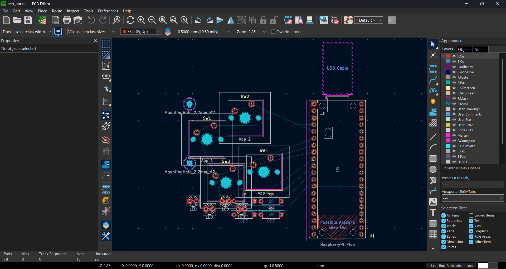
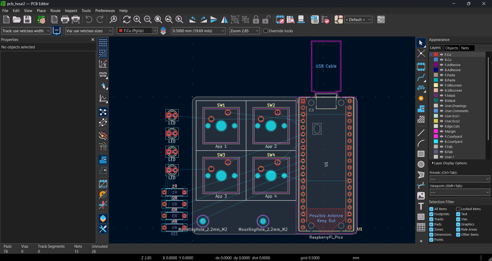
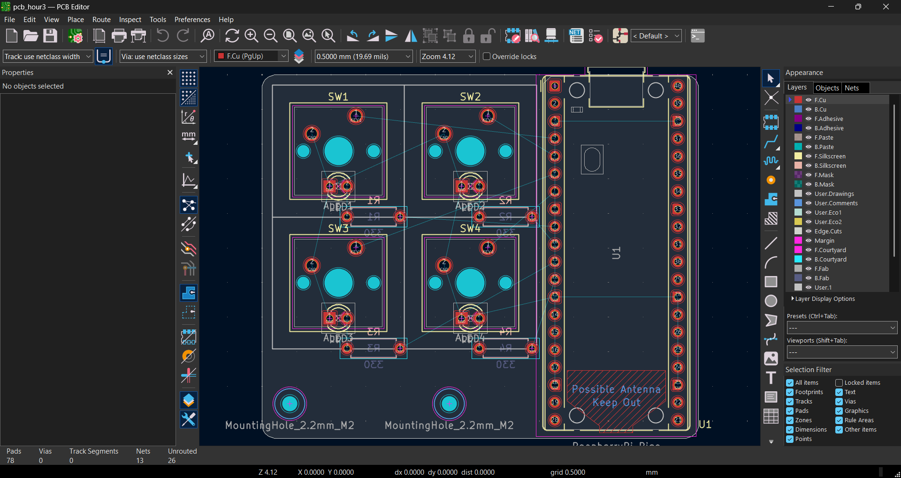
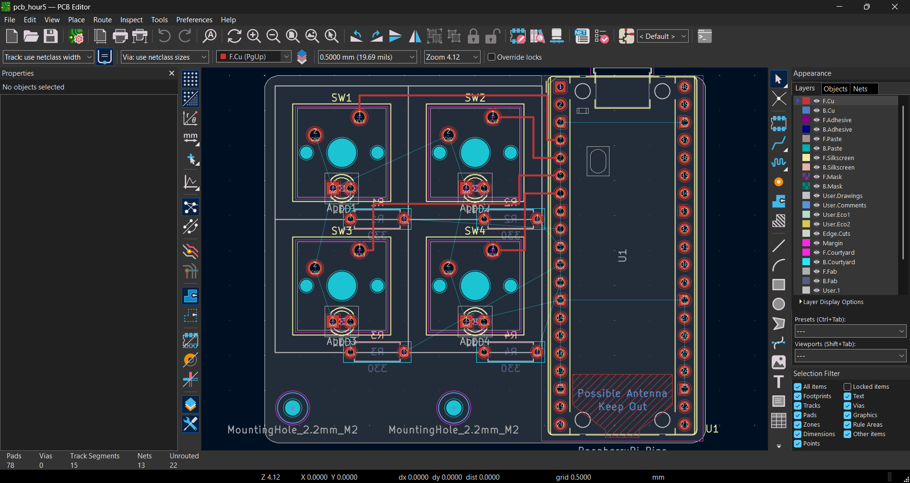
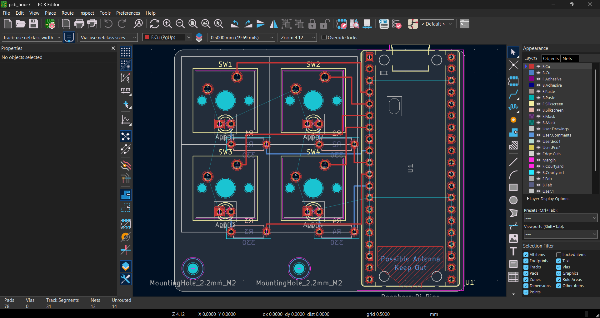

# Stream Deck PCB

A small 4-key USB macro pad, like a mini Elgato Stream Deck, built around a Raspberry Pi Pico.
This was my first PCB, designed in KiCad.


## The board

- 4 MX-style mechanical keys in a 2×2 layout
- 1 LED and 1 330 Ω resistor per key
- Raspberry Pi Pico, which also connects to the computer over USB
- 2-layer board with a ground fill

| Part | Pico pins | Wiring |
|---|---|---|
| Keys SW1–SW4 | GP2–GP5 | Pin → switch → GND (uses the internal pull-ups) |
| LEDs D1–D4 | GP6–GP9 | Pin → 330 Ω → LED → GND |

## Progress

| | |
|---|---|
|  Footprints placed |  Parts arranged, board outline |
|  Final layout |  First traces (SW1, SW2) |
|  All switches routed |  LEDs and resistors started |
|  Most nets routed |  Ground fill, fully routed |

## Firmware

[`firmware/code.py`](firmware/code.py) runs on CircuitPython and needs the `adafruit_hid` library.
The Pico acts as a USB keyboard: keys 1–4 send F13–F16 and light their LED while held.

## Repository layout

```
hardware/   KiCad project (schematic + PCB)
firmware/   CircuitPython firmware (code.py)
images/     Progress screenshots
JOURNAL.md  Build log (synced from Half Life)
```
