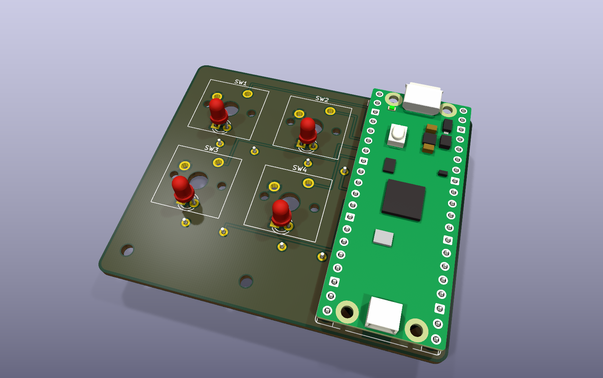
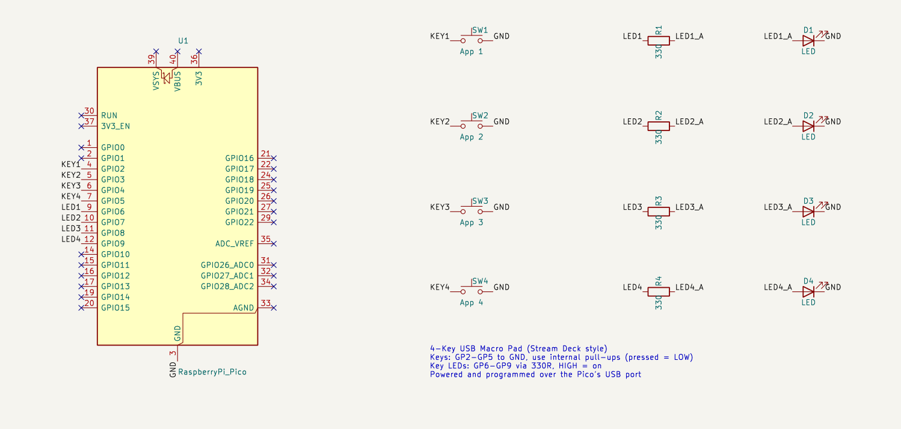
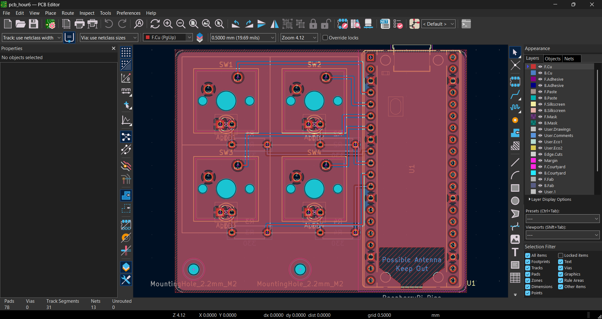
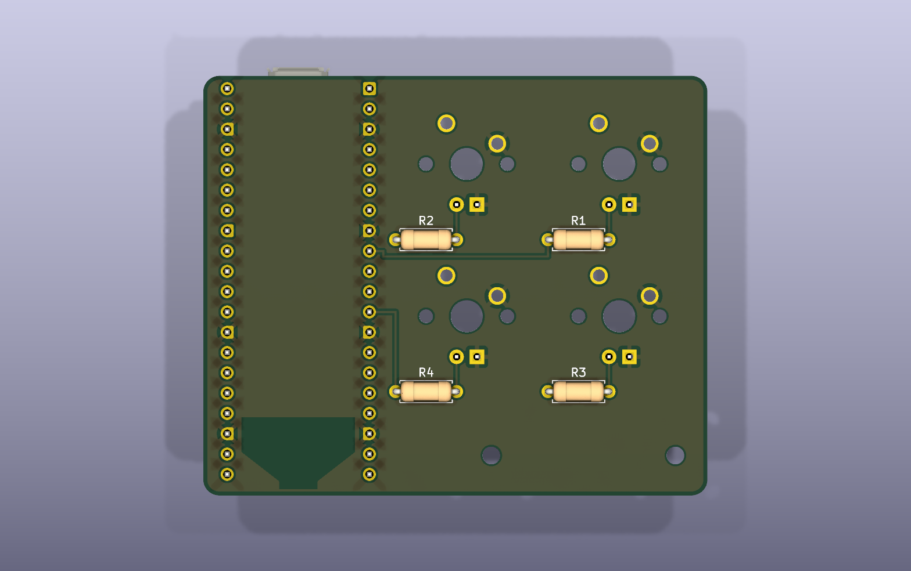

# Stream Deck PCB

A small 4-key USB macro pad, like a mini Elgato Stream Deck. Each key opens an app, a website, a
keyboard shortcut or a media control on your computer, and every key can be re-programmed by
editing one text file on the device — no reflashing.



## Features

- **4 mechanical keys** in a compact 2×2 layout (MX-style switches, standard 19.05 mm spacing)
- **Plug and play over USB**: the board shows up as a normal USB keyboard, so it needs no drivers
- **Programmable keys**: launch apps, type text, send shortcuts or media keys, all set in `keymap.json`
- **Per-key LEDs** that light up through translucent keycaps (optional)
- **Small board**: 63 × 52.5 mm, 2 layers, all through-hole parts, so it's easy to solder

## How it works

The brain is a **Raspberry Pi Pico** (RP2040). It's soldered onto the board and connects to the
computer with its own USB port, which also powers everything.

| Part | Pico pins | How it's wired |
|---|---|---|
| Keys SW1–SW4 | GP2–GP5 | Each key connects its pin to GND when pressed. The Pico's internal pull-up resistors keep the pin HIGH otherwise, so a press reads as LOW. |
| LEDs D1–D4 | GP6–GP9 | Pin → 330 Ω resistor → LED → GND. Driving the pin HIGH turns the LED on. The 330 Ω resistor limits the current to about 4 mA at 3.3 V. |

The firmware ([`firmware/code.py`](firmware/code.py)) runs on CircuitPython. It:

1. tells the computer it is a USB keyboard (HID) plus a media-key controller,
2. checks the 4 keys every few milliseconds, with debouncing so one press counts once,
3. looks up the pressed key's action in `keymap.json` and sends it, lighting that key's LED while it's held.

Because it acts as a real keyboard, the computer needs no extra software for most actions.

### Schematic



### PCB layout

| Front (KiCad PCB editor) | Back |
|---|---|
|  |  |

Front copper (red) carries the key signals and back copper (blue) carries the LED signals. Both
layers have a ground fill. The LEDs sit inside each switch's LED slot, and the resistors go on the back.

## Programming the keys

Edit `keymap.json` on the Pico's `CIRCUITPY` drive and save. The Pico reloads straight away. Each
of the 4 entries (top-left, top-right, bottom-left, bottom-right) is one key:

```json
{
  "keys": [
    { "label": "Web browser", "type": "launch", "command": "https://www.google.com" },
    { "label": "Notepad", "type": "launch", "command": "notepad" },
    { "label": "Task Manager", "type": "keys", "keys": ["CONTROL", "SHIFT", "ESCAPE"] },
    { "label": "Play / pause", "type": "media", "code": "PLAY_PAUSE" }
  ]
}
```

| `type` | What it does | Example |
|---|---|---|
| `launch` | **Windows:** presses Win+R, types the command and presses Enter. It works with app names, websites, folders and files. | `"command": "spotify"` |
| `keys` | Presses a shortcut (all keys together). Names come from [Keycode](https://docs.circuitpython.org/projects/hid/en/latest/api.html#adafruit-hid-keycode-keycode). | `"keys": ["GUI", "D"]` (show desktop) |
| `text` | Types a string | `"text": "hello@example.com"` |
| `media` | Sends a media key. Names come from [ConsumerControlCode](https://docs.circuitpython.org/projects/hid/en/latest/api.html#adafruit-hid-consumer-control-code-consumercontrolcode). | `"code": "MUTE"` |

`label` is just a note for you. If `keymap.json` is missing or broken, the keys fall back to
**F13–F16**. Those keys don't exist on normal keyboards, so they never clash with anything and you
can bind them to anything. [`host/launch_apps.ahk`](host/launch_apps.ahk) is an optional
AutoHotkey script that does this on Windows. On macOS or Linux, bind F13–F16 in the system keyboard-shortcut settings.

## Building one

1. **Order the PCB.** Upload [`fabrication/stream-deck-gerbers.zip`](fabrication/stream-deck-gerbers.zip)
   to JLCPCB (or any PCB maker). The defaults are fine: 2 layers, 1.6 mm, any colour.
2. **Buy the parts.** See [`bom.csv`](bom.csv) (or [`BOM.md`](BOM.md)).
3. **Solder.**
   - Start with the resistors on the **back** (R1–R4).
   - Then the 4 switches and the LEDs on the front. The LED's flat side/short leg goes to the square pad.
   - Solder the Pico last, USB end at the top edge.
4. **Install CircuitPython.**
   - Hold the Pico's BOOTSEL button while plugging it in, then drag the
     [CircuitPython UF2 for the Pico](https://circuitpython.org/board/raspberry_pi_pico/) onto the `RPI-RP2` drive.
   - Copy the `adafruit_hid` folder from the
     [CircuitPython library bundle](https://circuitpython.org/libraries) into `CIRCUITPY/lib/`.
5. **Copy the firmware.** Put [`firmware/code.py`](firmware/code.py) and
   [`firmware/keymap.json`](firmware/keymap.json) in the root of the `CIRCUITPY` drive. The LEDs
   sweep once on start-up, and then the keys are live.

## Repository layout

```
hardware/      KiCad 10 project (schematic + PCB): stream-deck.kicad_pro/.kicad_sch/.kicad_pcb
fabrication/   Gerber + drill files, zipped and unzipped
firmware/      CircuitPython firmware (code.py) and the key map (keymap.json)
host/          Optional AutoHotkey script for binding F13–F16 on Windows
images/        Renders and screenshots used in this README
bom.csv        Bill of materials
BOM.md         Parts list and costs (synced from Half Life)
JOURNAL.md     Build log (synced from Half Life)
```

## Credits

Designed in [KiCad](https://www.kicad.org/). The schematic, PCB layout and firmware were made with
help from Claude (Anthropic's AI assistant) driving KiCad through the
[KiCAD-MCP-Server](https://github.com/mixelpixx/KiCAD-MCP-Server).
